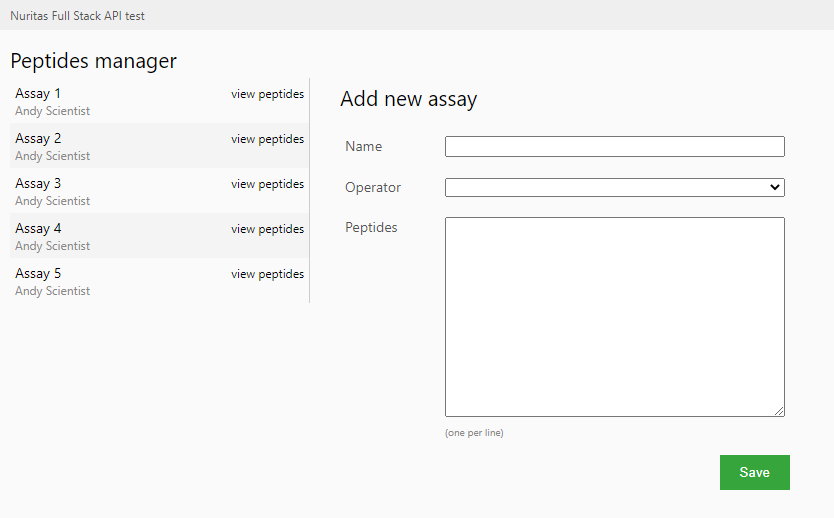

# Full-Stack API test

Welcome to the full stack API test!

In this test, you will run a small assays/peptides manager application.
The backend runs with Django and Django Rest Framework, the frontend runs with a small React application.

<p align="center">
    
</p>

## Install and Run

### Backend

1. Run the following command to install requirements for the backend:

```bash
cd backend;
pip install -r requirements.txt # it's just django and rest framework
```

2. Migrate and populate database

```bash
python manage.py migrate
python manage.py populate_database
```

3. Run the server

```bash
python manage.py runserver 0.0.0.0:9000
```

_Note: if you change the port, update the `frontend/constants.js` file as well_.

4. Verify it works: go to [Peptides API page](http://localhost:9000/peptides/api/)

### Frontend

1. (with another shell) Run the following command to install node modules:

```bash
cd frontend;
npm install
```

2. Run the server

```bash
npm start
```

This shuold automatically open the [frontend page](http://localhost:3000/).

# Application

The application is a simple assay and peptides manager.
We want to manage a set of assays done by our lab operators and save the results into the database.

The lab operators will give us the name of the assay and the list of peptides sequences they obtained in the assay.

For example, they will send us an email/excel file with:

```
Assay name: Assay number 10
Peptides:
    AABBCC
    CCDDEE
    DDCCZZ
    AABBCCDDFF
```

In the UI page, we can view the previous assays, the existing peptides and add new assays.

## Models

Models can be viewed in `backend/peptides/models.py` file.

The assay must have a user associated and can have none or many peptides associated. A peptide is just a name plus a sequence (the name is autogenerated when it is added to the database).

## API

The API entrypoint is `backend/peptides/api/urls.py`, and it it works with Django Rest Framework.
The relevant code for the API is the view files: `backend/peptides/api/views.py`

## UI

For simplicity, the UI has no routing and everything can be done in the main page.
The main UI component is `frontent/src/PeptidesHome/PeptidesHome.js`.

# Excercises

As you can see, the application is small but contains interesting situations.

1. At the moment, all the users can be added as operators for the assays. Change the UI to limit the selection to only the users who belong to the `Scientists` group;

   (file `frontend/src/PeptidesHome/AssayForm.js`)

2. If you try to add a new assay, you will notice that the peptides are not saved! Change the relevant code to associate the peptides sent to the backend during the creation of a new Assay. Requirement: we don't like two peptides with same sequence! Plus, a name has to be added, following the pattern `pep_{number}` and names should be unique as well.

   (file `backend/peptides/api/views.py`)

3. We want to distinguish between `Wet` and `Dry` assays. Unfortunately, we were not able to do that in the past and all the records have been lost. Add a field called `assay_type` to the Assay model which can only have `Wet` and `Dry` values. We can assume that all old assays were `Wet`.

   (file `backend/peptides/models.py` and do the required actions)

4. Display the assay type in the UI.

   (file `frontend/src/PeptidesHome/AssaysList.js`)

5. Allow to select the assay type when adding a new Assay.

   (file `frontend/src/PeptidesHome/AssayForm.js`)

## Hints

- [Django tutorial](https://docs.djangoproject.com/en/3.2/intro/tutorial01/) is a great starting point (and covers almost all requirements);
- look at `choices` argument of `CharField` in the official Django API reference;
- ES6 has a built-in `filter` methods for arrays;
- Developer tools of each browser have a Network section that can be used to inspect API calls;
- `console.log` (ES6) and `print` (Python) are dirty but always useful!

# Results

Feel free to comment code as much as you can.

The project can be zipped and sent back to us: please, do not include `frontend/node_modules` folder!
